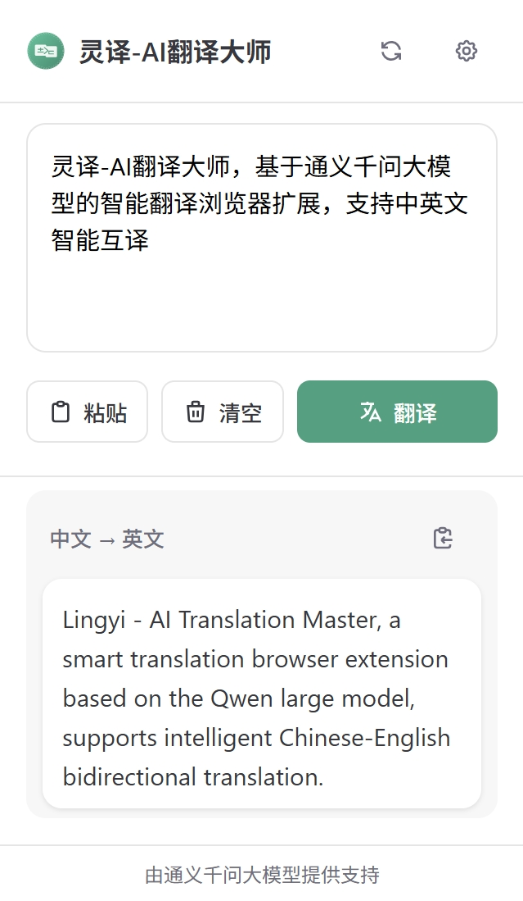
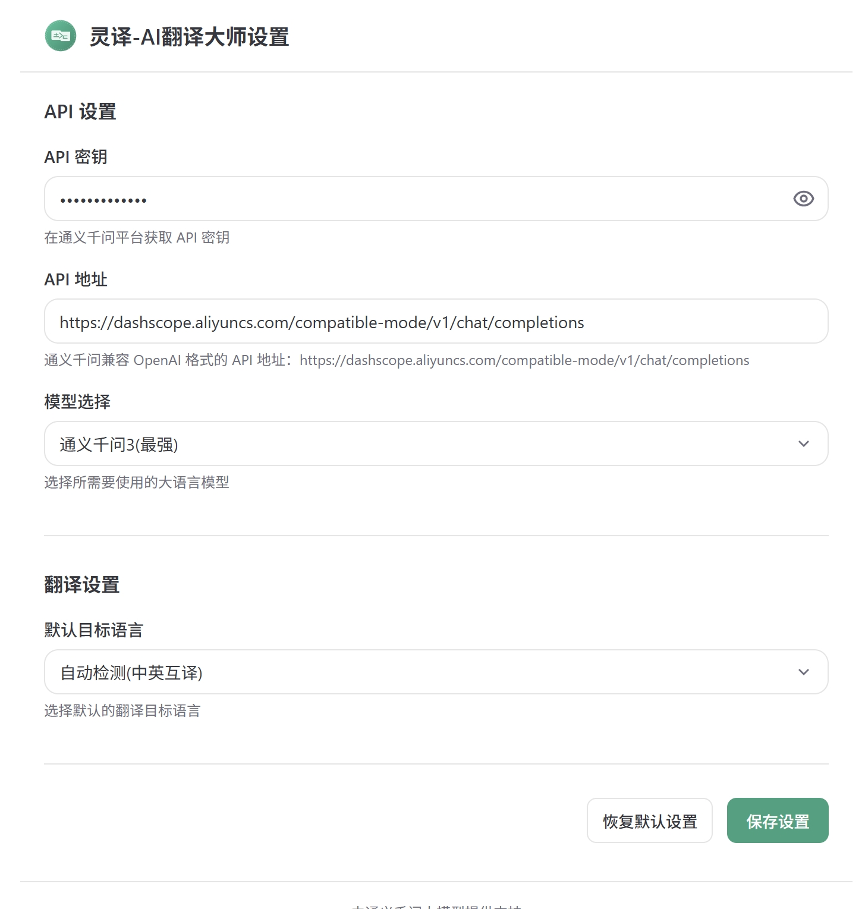

# 灵译-AI翻译大师 (LingYi - AI Translation)

<p align="center">
    
</p>

> 基于通义千问大模型的智能翻译浏览器扩展，提供沉浸式体验和强大功能

## 📑 目录

- [项目概述](#项目概述)
- [项目亮点](#项目亮点)
- [功能特性](#功能特性)
- [界面展示](#界面展示)
- [技术架构](#技术架构)
- [使用指南](#使用指南)
- [开发者指南](#开发者指南)
- [自动部署流程](#自动部署流程)
- [常见问题](#常见问题)
- [贡献指南](#贡献指南)
- [许可证](#许可证)

## 📌 项目概述

灵译-AI翻译大师是一款基于阿里云通义千问大语言模型的Chrome浏览器扩展，专为需要高质量中英文翻译的用户设计。不同于传统翻译工具，灵译利用先进的AI技术提供更加准确、地道的翻译结果，特别适合学术、商业和日常交流场景使用。

本扩展通过打字机效果、自动滚动等设计，提供更加流畅的用户体验，让翻译过程变得轻松愉悦。同时，组件化架构设计使得代码易于维护和扩展，为开发者提供了良好的协作基础。

## 🌟 项目亮点

- **AI 驱动翻译**: 基于通义千问大模型，提供超越传统机器翻译的高质量结果
- **上下文理解**: 保持多轮对话历史，实现连贯的翻译体验
- **打字机效果**: 模拟人工输出的逐字显示，提供沉浸式体验
- **自适应界面**: 完美支持明/暗模式，自动适应系统设置
- **模块化架构**: 基于Vue 3组件化开发，易于维护和扩展
- **自动化部署**: 集成GitHub Actions，标签发布自动构建和发布

## ✨ 功能特性

- 🚀 支持中英文智能互译
- 🔄 自动识别源语言，无需手动选择
- 📋 一键粘贴剪贴板内容
- 🎭 打字机效果，提供流畅的翻译展示体验
- 📜 自动滚动功能，内容始终保持在视野范围内
- 🎛️ 可选择不同的通义千问模型（qwen3、qwen-max等）
- 🌙 支持明/暗模式自适应
- 🔄 组件化架构，易于维护和扩展
- 🚀 支持GitHub Actions自动构建与发布
- 💾 持久化保存对话历史与设置

## 📊 界面展示

<p align="center">
    
    
</p>

## 🏗️ 技术架构

### 项目结构

```
├── src/
│   ├── popup/              # 弹出窗口相关文件
│   │   ├── components/     # 组件目录
│   │   │   ├── HeaderComponent.vue      # 头部组件
│   │   │   ├── InputComponent.vue       # 输入组件
│   │   │   ├── OutputComponent.vue      # 输出组件
│   │   │   ├── TypewriterComponent.vue  # 打字机效果组件
│   │   │   └── index.js                 # 组件索引
│   │   ├── App.vue         # 主应用组件
│   │   └── main.js         # 入口文件
│   ├── options/            # 选项页面相关文件
│   │   ├── components/     # 设置界面组件
│   │   │   ├── ApiSettingsComponent.vue   # API设置组件
│   │   │   ├── TranslationSettingsComponent.vue # 翻译设置组件
│   │   │   └── ...                         # 其他设置组件
│   └── background/         # 后台脚本
│       └── index.js        # 服务工作进程，处理API调用和翻译逻辑
├── .github/workflows/      # GitHub Actions配置
│   └── build-and-release.yml  # 自动构建发布工作流
└── dist/                   # 构建输出目录
```

### 核心技术特性

#### 打字机效果与自动滚动

灵译的打字机效果通过专门的 `TypewriterComponent` 组件实现，具备以下特性：

1. **逐字显示**: 设置可调速度的计时器，模拟打字效果
2. **自动滚动**: 随着内容增加，自动滚动保持最新内容可见
3. **光标闪烁**: 添加模拟光标闪烁动画，增强真实感
4. **自动监听**: 监听文本变化，自动重启打字效果
5. **资源管理**: 组件生命周期内正确管理计时器资源

核心实现：
```javascript
typingTimer = setInterval(() => {
  displayedText.value += props.text.charAt(currentIndex);
  currentIndex++;
  scrollToBottom();
}, props.speed);
```

#### 组件化架构与状态管理

项目使用Vue 3的组合式API (Composition API)，实现了高效的组件通信和状态管理：

1. **状态隔离**: 每个组件维护自己的内部状态，减少副作用
2. **事件驱动**: 通过emits定义明确的组件通信接口
3. **响应式设计**: 利用Vue 3 reactive/ref API实现高效状态更新
4. **生命周期管理**: 合理使用onMounted、onUnmounted等钩子函数
5. **动态DOM更新**: 响应式地处理UI状态变化

组件通信示例：
```vue
<InputComponent
  v-model="sourceText"
  @translate="handleTranslate"
  @paste="handlePasteFromInput"
  @clear="handleClearInput"
/>
```

#### 流式翻译响应处理

扩展实现了对通义千问API流式响应的处理，提供更好的用户体验：

1. 使用`fetch`的流式API读取响应数据
2. 解码数据块并解析JSON格式
3. 通过回调函数逐步更新翻译结果
4. 使用Chrome消息传递机制将更新发送到前端
5. 前端通过打字机效果展示翻译结果

## 📝 使用指南

### 安装方法

#### 从Chrome应用商店安装（推荐）
1. 访问Chrome网上应用店
2. 搜索"灵译-AI翻译大师"
3. 点击"添加到Chrome"按钮

#### 手动安装（开发版）
1. 下载最新发布版本的zip包
2. 解压到本地文件夹
3. 打开Chrome扩展管理页面 `chrome://extensions/`
4. 开启"开发者模式"
5. 点击"加载已解压的扩展程序"，选择解压目录

### 初始设置

1. 安装扩展后，点击工具栏中的灵译图标
2. 点击设置图标（⚙️）进入设置页面
3. 配置您的通义千问API密钥（在[阿里云通义千问平台](https://dashscope.aliyuncs.com/)获取）
4. 选择您偏好的模型和默认翻译方向
5. 点击"保存设置"完成配置

### 日常使用

1. 点击浏览器工具栏中的灵译图标
2. 在输入框中输入或粘贴要翻译的文本
3. 点击"翻译"按钮，AI将自动检测语言并翻译
4. 翻译结果会以打字机效果逐字显示
5. 使用复制按钮可将结果复制到剪贴板

### 高级技巧

- **连续对话**：扩展会记住对话历史，保持上下文连贯性
- **重置对话**：点击刷新按钮可开始新的对话
- **模型选择**：不同的任务可选择不同的模型，如文学翻译推荐使用qwen3
- **自定义API**：支持配置自定义的API端点，适应不同的部署环境

## 👨‍💻 开发者指南

### 环境搭建

1. 克隆仓库
```bash
git clone https://github.com/ospoon/lingyi-ai-translation.git
cd lingyi-ai-translation
```

2. 安装依赖
```bash
npm install
```

3. 开发模式运行
```bash
npm run dev
```

4. 生产构建
```bash
npm run build
```

### 开发技术栈

- **前端框架**: Vue 3.3.4
- **构建工具**: extension.js (基于Vite)
- **API接口**: 通义千问兼容OpenAI格式API
- **浏览器API**: Chrome Extension API

### 代码贡献流程

1. Fork本项目仓库
2. 创建您的特性分支 (`git checkout -b feature/amazing-feature`)
3. 提交您的改动 (`git commit -m 'Add some amazing feature'`)
4. 推送到分支 (`git push origin feature/amazing-feature`)
5. 创建新的Pull Request

## 🚀 自动部署流程

项目使用GitHub Actions实现持续集成和自动发布，工作流程如下：

1. **触发条件**: 
   - 当创建新的版本标签 `v*`（如v1.0.0）时自动触发构建

2. **构建环境**:
   - 使用Ubuntu最新版作为构建环境
   - 配置Node.js 20.x版本运行环境
   - 使用npm缓存加速依赖安装

3. **构建步骤**:
   ```yaml
   steps:
     - name: Checkout code
       uses: actions/checkout@v4
     
     - name: Set up Node.js
       uses: actions/setup-node@v4
       with:
         node-version: '20.x'
         cache: 'npm'
   
     - name: Install dependencies
       run: npm ci
     
     - name: Build extension
       run: npm run build
   ```

4. **打包与发布**:
   - 从Git标签提取版本号
   - 将扩展打包为zip文件
   - 创建GitHub Release
   - 将打包文件上传到Release

5. **发布新版本**:
   ```bash
   git tag v1.0.0
   git push origin v1.0.0
   ```

完整工作流配置详见 [.github/workflows/build-and-release.yml](.github/workflows/build-and-release.yml)

## ❓ 常见问题

### 1. 为什么需要API密钥？
灵译使用通义千问API进行翻译，需要您的API密钥才能访问服务。您可以在[阿里云通义千问平台](https://dashscope.aliyuncs.com/)注册并获取API密钥。

### 2. 翻译速度慢怎么办？
翻译速度主要受网络和API响应时间影响。建议:
- 检查网络连接
- 尝试使用qwen-turbo等响应更快的模型
- 减少单次翻译文本量

### 3. 如何保存常用翻译？
当前版本不支持保存历史翻译，但您可以使用复制功能将结果保存到其他应用程序中。我们计划在未来版本中添加翻译历史功能。

### 4. 支持哪些浏览器？
目前主要支持Chrome浏览器。我们正在开发Firefox和Edge版本，敬请期待。

### 5. API密钥安全吗？
您的API密钥仅存储在浏览器本地，不会传输到除阿里云通义千问API之外的任何服务器。

## 🤝 贡献指南

我们非常欢迎各种形式的贡献，包括但不限于：

- 功能请求和建议
- 错误报告和修复
- 文档改进
- 代码重构和性能优化
- 新功能开发

在提交贡献前，请先查看[贡献指南](CONTRIBUTING.md)了解详情。

## 📄 许可证

该项目采用MIT许可证 - 详情请参阅 [LICENSE](LICENSE) 文件

---

*灵译-AI翻译大师由 [@OSpoon](https://github.com/OSpoon) 开发维护*

*通义千问是阿里云旗下的大规模预训练模型系列，本项目与阿里云无关，仅作为开源社区贡献。*